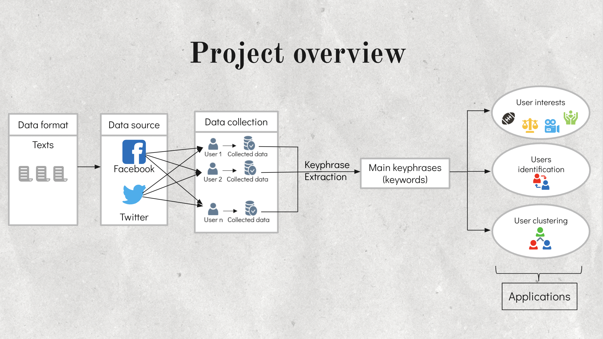
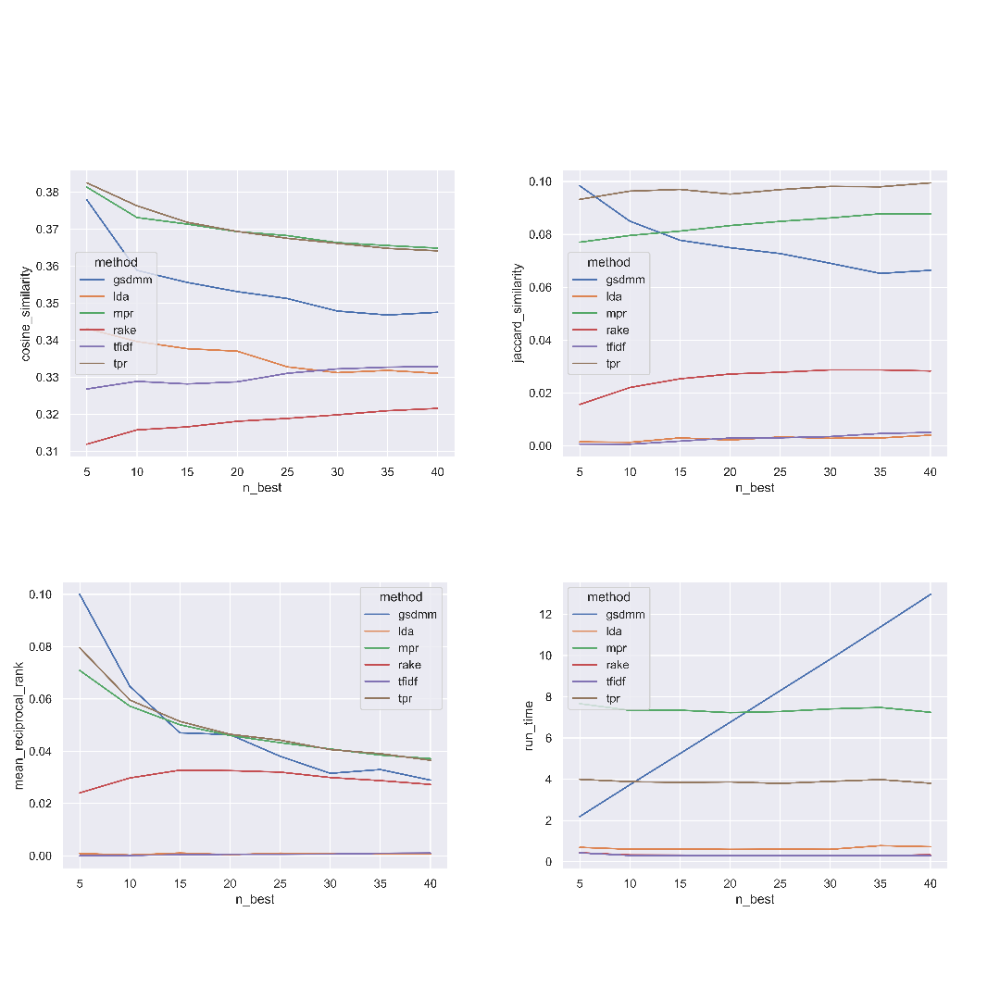
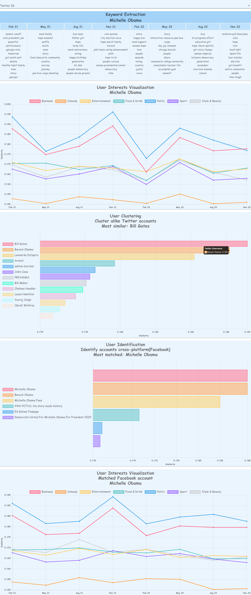

# Twitter User Analytics

## About


* Features:
    * User interest over time
    * User identification across social platform
    * User behavior clustering
* How:
    * Built dataset:
        * 300 Twitter users; 1000 posts each 
        * 1800 Facebook users; 600 posts each; ratio 1 Twitter - 6 Facebook candidates
        * 1100 stopwords
        * 3500 user interest keywords on 7 topics: business, comedy, entertainment, food & drink, politic, sport, style & beauty
    * Evaluated 6 keyword extraction methods:
        * TF-IDF
        * LDA
        * GSDMM
        * RAKE
        * TOPIC-RANK
        * MULTIPARTITE-RANK
    * Embeded extracted keyword using Fasttext word embedding
        * User interest: Cosine similarity with 3500 topic keywords
        * User identification: Cosine similarity with 6 Facebook candidates
        * User behavior clustering: Spectral clustering with other Twitter users

## Application


## Methods evaluation



## Full webpage



## Run Command
```
chmod +x ./run.sh
./run.sh
```
